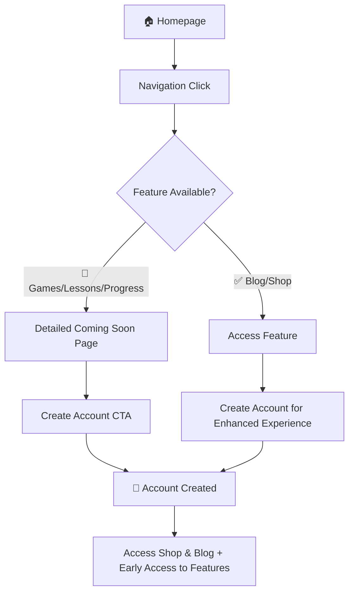

# User Flow & Authentication Strategy

## 🎯 **Strategy Overview**

**Yes, users SHOULD create accounts now!** Here's why this approach maximizes value for both users and your business:

## ✅ **Why Users Should Sign Up Now**

### **Immediate Value**
- **🛒 Shop Access**: Purchase and download resources instantly
- **📖 Blog Engagement**: Save favorite articles, get personalized recommendations
- **🔄 Progress Preservation**: When features launch, their data is already there
- **📧 Early Access**: First to know about new features and exclusive content

### **Business Benefits**
- **📊 User Base Building**: Grow your community before feature launches
- **💌 Email Marketing**: Direct communication channel for announcements
- **🎯 Market Validation**: Understand user demand for different features
- **💰 Revenue Generation**: Immediate monetization through Shop

## 🚀 **User Journey Flow**

### **New Visitor Journey**


### **Authenticated User Experience**
- ✅ **Full Shop Access** - Purchase, download, manage resources
- ✅ **Enhanced Blog** - Save articles, get recommendations, comment
- 🚧 **Dashboard Preview** - Beautiful coming-soon page with feature details
- 🚧 **Games Preview** - Detailed game descriptions, early access signup
- 🚧 **Progress Tracking** - Analytics mockups, beta access registration

## 📱 **Detailed Coming Soon Pages**

### **Games Page (`/coming-soon/games`)**
- **Visual Features**: Game mockups, UI previews, feature demonstrations
- **Benefits**: Teacher tools, student engagement, progress tracking
- **CTA**: "Create Account for Early Access" + "Explore Shop Resources"

### **Custom Lessons Page (`/coming-soon/themes`)**
- **Visual Features**: Lesson builder mockups, content examples
- **Benefits**: Curriculum integration, collaboration tools, analytics
- **CTA**: "Start Teaching Today" + "Read Teaching Blog"

### **Progress Tracking Page (`/coming-soon/progress`)**
- **Visual Features**: Dashboard mockups, report samples, analytics charts
- **Benefits**: Student insights, parent communication, data-driven teaching
- **CTA**: "Get Beta Access" + "Browse Resources"

## 🔐 **Authentication Strategy**

### **Current Implementation**
- ✅ **Supabase Auth**: Robust authentication system already in place
- ✅ **User Profiles**: User data storage and management
- ✅ **Role Management**: Teacher/Student/Admin role support
- ✅ **Session Management**: Secure, persistent login sessions

### **Sign-Up Flow**
1. **User clicks "Create Account"**
2. **Choose Role**: Teacher, Student, or Parent
3. **Basic Info**: Name, email, password
4. **Profile Creation**: Automatic user profile setup
5. **Welcome Experience**: Onboarding tour of available features
6. **Immediate Access**: Shop and Blog available instantly

### **Post-Signup Experience**
```
📧 Welcome Email Sequence:
├── Day 0: Welcome + Shop & Blog tour
├── Day 3: Teaching resources spotlight
├── Day 7: Coming features preview
├── Day 14: Community engagement
└── Monthly: Feature updates & new content
```

## 🎨 **Marketing Positioning**

### **Homepage Messaging**
- **Primary CTA**: "Start Teaching Better Today" → Signup
- **Secondary CTA**: "Explore Resources" → Shop
- **Feature Previews**: Beautiful teasers with "Coming Soon" badges

### **Coming Soon Page Strategy**
- **Not just placeholders** - Full marketing pages that sell the vision
- **Specific benefits** - Tailored to each user type (teacher, student, parent)
- **Social proof** - Testimonials, feature requests, community size
- **Clear timelines** - "Beta starting Q2 2024" type messaging

## 📊 **Success Metrics**

### **Key Performance Indicators**
- **Sign-up Rate**: Target 15%+ conversion from coming-soon pages
- **Email Engagement**: 25%+ open rates on feature announcements
- **Shop Revenue**: Immediate monetization from resource sales
- **Feature Demand**: Track clicks on coming-soon features

### **User Retention Strategy**
- **Weekly Blog Content**: Keep users engaged with valuable content
- **Monthly Shop Updates**: New resources and exclusive offers
- **Feature Beta Access**: Early access for existing users
- **Community Building**: Teacher forums, success stories, collaboration

## 🚀 **Implementation Status**

### ✅ **Ready for Production**
- [x] Blog fully functional with engaging content
- [x] Shop with professional resource catalog
- [x] Beautiful, detailed coming-soon pages for disabled features
- [x] Robust authentication system
- [x] Feature flag system for controlled rollouts
- [x] Professional navigation with "Soon" badges

### 🚧 **In Development (localhost only)**
- [ ] Games - Full functionality available for testing
- [ ] Custom Lessons - Dashboard integration in progress
- [ ] Progress Tracking - Analytics engine development

## 🎯 **Launch Recommendations**

### **Immediate Actions**
1. **Deploy current state** - Shop and Blog are ready for users
2. **Marketing campaign** - Focus on available features + coming attractions
3. **Content strategy** - Regular blog posts to drive engagement
4. **Email capture** - Build list for feature launch announcements

### **User Communication**
- **Homepage banner**: "🎉 Shop & Blog Live! Games & Lessons Coming Soon!"
- **Email signatures**: "Early access to exciting new features"
- **Social media**: "Join 1000+ educators already using LanguageGems"

## 💡 **Why This Strategy Works**

✅ **Immediate Value**: Users get real benefits right away (Shop + Blog)
✅ **Future Excitement**: Coming-soon pages build anticipation and desire
✅ **Data Collection**: Build user base and understand demand
✅ **Revenue Generation**: Start monetizing immediately through Shop
✅ **Community Building**: Establish user base before full feature launch
✅ **Feedback Loop**: Early users provide valuable input for development

---

**Bottom Line**: This approach transforms "waiting for features" into "building a community of excited early adopters who are already getting value and can't wait for more." 